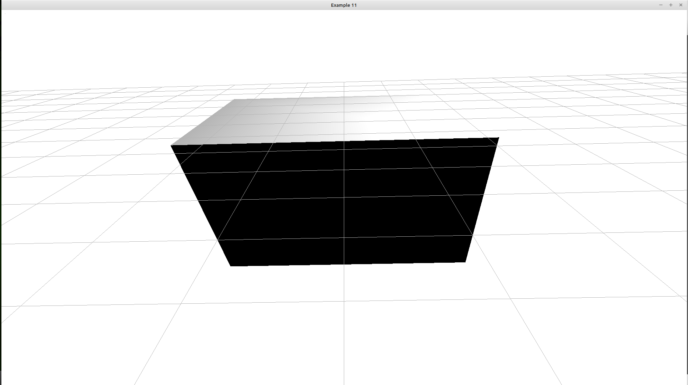

\page bitrl_example_11 BitRL Example 11 Create a rigid body in Chrono

The <a href="https://github.com/projectchrono/chrono">Chrono</a> library is the main library that _bitrl_ is using in order
to simulate robots and create environments for reinforcement learning agents. As such, knowing your way around
Chrono is essential. However, Chrono is a relatively large library with many components and therefore not necessarily easy
to grasp. In a series of examples, we will see main components of the library that _bitrl_ utilizes.

You should have compiled Chrono with <a href="https://irrlicht.sourceforge.io/">Irrlicht</a> support.

The main interface for creating rigid bodies in Chrono is the <a href="https://api.projectchrono.org/9.0.0/classchrono_1_1_ch_body.html">ChBody</a>
class. You can also find this <a href="https://api.projectchrono.org/9.0.0/rigid_bodies.html"> Rigid Bodies</a> helpful.
_ChBody_ is an abstract class, and therefore we cannot instantiate it directly. Chrono provides various classes however we can 
immediately use. The one we will use in this example is the _ChBodyEasyBox_ class. This is defined in the _<chrono/physics/ChBodyEasy.h>_ header.
Let's first create a box and try to visualize it. Below is the function that constructs a box.

@code{.cpp}
std::shared_ptr<chrono::ChBody> create_box(real_t xlength, real_t ylength, real_t zlength,
real_t density, bool create_visualization)
{

    // build the chassis of the robot
    auto box = chrono_types::make_shared<chrono::ChBodyEasyBox>(xlength, ylength, zlength,
                                                                                        density, create_visualization);
    box -> SetMass(1.0);
    box -> SetPos(chrono::ChVector3d(0.0, 0.0, 0.22));

    // allow the chassis to move
    box -> SetFixed(true);
    return box;

}
@endcode

The following is a helper for setting up the visualization

@code{.cpp}
void prepare_visualization(chrono::irrlicht::ChVisualSystemIrrlicht& visual)
{
visual.SetWindowSize(WINDOW_WIDTH, WINDOW_WIDTH); //WINDOW_HEIGHT);
visual.SetWindowTitle(WINDOW_TITLE);
visual.Initialize();

    visual.AddLogo();
    visual.AddSkyBox();
    visual.AddCamera({0, -2, 1}, {0, 0, 0});
    visual.AddTypicalLights();
    visual.BindAll();
}
@endcode

Below is the main function:

@code{.cpp}
int main()
{

    using namespace example_11;

    chrono::ChSystemSMC sys;

    // build the body and add it to the system
    // we want to simulate
    auto box = create_box(1.0, 1.0, 1.0, 1.0, true);
    sys.Add(box);

    // create the object that handles the visualization
    chrono::irrlicht::ChVisualSystemIrrlicht visual;
    prepare_visualization(visual);
    visual.AttachSystem(&sys);

    while (visual.Run())
    {

        // Irrlicht must prepare frame to draw
        visual.BeginScene();

        // .. draw items belonging to Irrlicht scene, if any
        visual.Render();

        // .. draw a grid
        tools::drawGrid(&visual, 0.5, 0.5);

        // Irrlicht must finish drawing the frame
        visual.EndScene();
    }
}
@endcode

Compiling and running the code will not do anything exciting as can be verified by the image below

Rigid bodies in Chrono have a lot of attributes and the API is quite rich. Here are some of the method that we are typically interested

@code{.cpp}

// position of the CoM
GetPos()

// linear velocity of the CoM
GetLinVel()

// linear acceleration of the CoM
GetLinAcc()
@endcode

Let's change the main function so that it prints the position and the velocity of the box:

@code{.cpp}
int main()
{

    using namespace example_11;
    chrono::ChSystemSMC sys;

    // build the body and add it to the system
    // we want to simulate
    auto box = create_box(1.0, 1.0, 1.0, 1.0, true);
    sys.Add(box);

    BOOST_LOG_TRIVIAL(info)<<"Position of CoM: "<<box -> GetPos();
    BOOST_LOG_TRIVIAL(info)<<"Linear velocity of CoM: "<<box -> GetLinVel();

}
@endcode

This prints the following

@code
[2026-02-07 11:40:39.051115] [0x00007fdfbd563800] [info]    Position of CoM: 0  0  0.22
[2026-02-07 11:40:39.051130] [0x00007fdfbd563800] [info]    Linear velocity of CoM: 0  0  0
@endcode

A question to ask is to which coordinate system the output refers to, The world reference frame or the one local to the body?